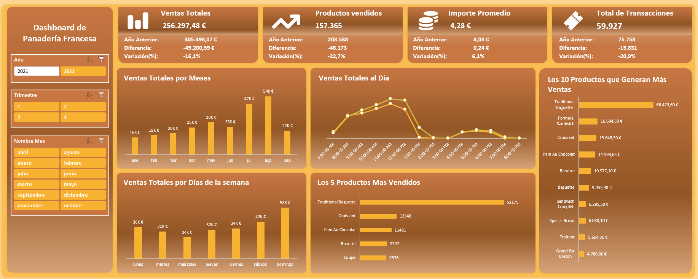

# Dashboard de French Bakery en Excel

¡Bienvenido a mi proyecto de Dashboard de Panadería Francesa en Excel! Este proyecto utiliza datos extraídos de Kaggle, que han sido limpiados y preparados con Power Query para crear un dashboard interactivo.



## Contenidos

- [Descripción del Proyecto](#descripción-del-proyecto)
- [Proceso de Creación](#proceso-de-creación)
- [Instalación](#instalación)
- [Características](#características)
- [Fuentes de Datos](#fuentes-de-datos)
- [Contribuciones](#contribuciones)
- [Contacto](#contacto)

## Descripción del Proyecto

Este proyecto consiste en un **dashboard interactivo de ventas** desarrollado en Excel utilizando datos de 2021 y 2022. El dashboard permite analizar el rendimiento de las ventas, incluyendo comparaciones entre años y visualización de KPIs clave, ayudando a identificar tendencias y tomar decisiones basadas en datos.

## Proceso de Creación

- Utilicé Power Query en Excel para limpiar los datos que incluye en renombrar las columnas, cambiar los separadores para asegurar que los datos se leyeran correctamente como números, corrigiendo formatos y eliminando duplicados.
- Creé una tabla de calendario con Power Query que nos permita un análisis por periodos.
- Establecí relaciones entre las tablas para crear un modelo de datos sólido.
- Utilicé tablas dinámicas para crear las visualizaciones interactivas y KPIs en el dashboard.

## Instalación

Para ejecutar este proyecto localmente, sigue los siguientes pasos:

1. Clona este repositorio:
   
   ```bash
   git clone https://github.com/iadataweb/dashboard-french-bakery.git

## Características
- Tarjetas KPI:
  - Ventas totales.
  - Cantidad de productos vendidos.
  - Importe promedio.
  - Total de transacciones.
- Gráficos Dinámicos:
  - Ventas totales por mes.
  - Ventas totales por día.
  - Ventas totales por días de la semana.
  - Los 5 productos más vendidos.
  - Los 10 productos que generan más ventas.

## Fuentes de Datos

Este proyecto utiliza datos extraídos de la [Kaggle](https://www.kaggle.com/datasets/matthieugimbert/french-bakery-daily-sales), específicamente del conjunto de datos de **French bakery daily sales**.

## Contribuciones

Las contribuciones son bienvenidas. Si deseas contribuir, siéntete libre de abrir un issue o un pull request en este repositorio.

## Contacto

- **LinkedIn:** [Carlos Injante](https://www.linkedin.com/in/20ismael1999/)

¡Gracias por visitar mi proyecto!
